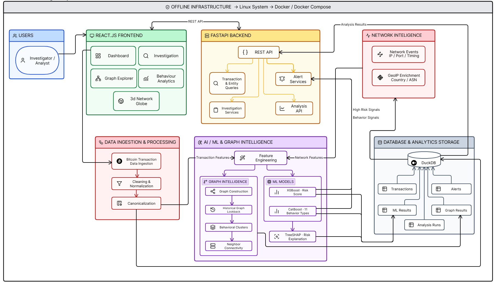

# TraceGrid — AI-Powered Bitcoin Transaction Forensic Intelligence

[](https://www.sih.gov.in/)
[](https://ntro.gov.in/)
[](https://www.python.org/)
[](https://fastapi.tiangolo.com/)
[](https://react.dev/)
[](https://www.typescriptlang.org/)
[](https://duckdb.org/)
[](https://xgboost.readthedocs.io/)
[](https://catboost.ai/)
[](https://www.docker.com/)

TraceGrid is an offline forensic analysis platform designed for forensic analysts and technical investigators examining Bitcoin transaction traffic and related network telemetry. Developed for Smart India Hackathon 2026 (Problem Statement 26146, National Technical Research Organisation), the platform ingests bulk transaction metadata, reconstructs entity and address relationships, extracts temporal and topological graph features, and runs supervised machine learning models to detect anomalies and attribute behavioral typologies.

Rather than treating on-chain ledger records and network peer observations as isolated data silos, TraceGrid normalizes both into a unified canonical schema stored in an embedded DuckDB analytical database. Production models—an XGBoost binary risk classifier and a CatBoost multiclass typology classifier—score transactions and entities, while native TreeSHAP attributions expose feature-level evidence directly to investigators. The entire platform runs locally inside Docker containers without external API calls or internet access at runtime.

---

## 📑 Table of Contents

- [The Core Purpose](#-the-core-purpose)
- [The Investigation Problem](#-the-investigation-problem)
- [Key Features](#-key-features)
- [Investigation Workflow](#-investigation-workflow)
- [AI/ML & Explainability](#-aiml--explainability)
- [Network Intelligence](#-network-intelligence)
- [System Architecture](#-system-architecture)
- [Tech Stack](#-tech-stack)
- [Getting Started](#-getting-started)
  - [1. Running with Docker Compose](#1-running-with-docker-compose-recommended)
  - [2. Service Endpoints](#2-service-endpoints)
  - [3. Stopping and Resetting](#3-stopping-and-resetting)
- [Local Development](#-local-development)
  - [Prerequisites](#prerequisites)
  - [Backend Setup](#backend-setup)
  - [Frontend Setup](#frontend-setup)
- [Offline & Air-Gapped Deployment](#-offline--air-gapped-deployment)
- [API Reference](#-api-reference)
- [Project Directory Structure](#-project-directory-structure)
- [Current Scope & Limitations](#-current-scope--limitations)
- [Attribution & Problem Statement](#-attribution--problem-statement)

---

## 🎯 The Core Purpose

Analyzing illicit Bitcoin activity is inherently difficult because evidentiary signals are fragmented across multiple operational layers:

- **On-chain transactions**: Inputs, outputs, satoshi values, fee rates, locktimes, and UTXO structures.
- **Wallet and address profiles**: Address reuse frequency, balance trajectories, active lifespans, and counterparty degree.
- **Temporal dynamics**: Inter-transaction arrival intervals, bursts, and clustering around specific operating hours.
- **Network telemetry**: Peer IP addresses, communication ports, protocol version flags, and propagation timing.
- **Geographic and routing metadata**: Origin countries, Autonomous System Numbers (ASNs), and relay coordinates.
- **Relational topology**: Multi-hop transaction chains, peel chains, mixing patterns, and fan-in/fan-out hubs.

When investigators examine raw transaction hashes or tabular ledger extracts in isolation, structural context is lost. A transaction with a standard fee rate may appear normal on-chain, but when correlated with sudden multi-hop relay bursts, non-standard peer ports, and high address reuse, it represents an investigative lead.

TraceGrid brings these disparate data sources into a single offline analysis environment. It correlates transaction records with network observations, applies graph feature extraction, runs supervised machine learning models to score risk, explains why each prediction was made using TreeSHAP, and organizes suspicious findings into prioritized leads for human review.

> **Operational Scope**: TraceGrid is an analytical platform for structured bulk metadata datasets. It does not perform live network traffic sniffing, real-time packet interception, or autonomous criminal identification. All models evaluate data provided in ingested datasets.

---

## 🧩 The Investigation Problem

```
┌────────────────────────┐      ┌────────────────────────┐
│  Bitcoin Transactions  │      │   Network Telemetry    │
│  (UTXO, Fees, Outputs) │      │  (IPs, Ports, ASNs)    │
└───────────┬────────────┘      └───────────┬────────────┘
            │                               │
            └───────────────┬───────────────┘
                            ▼
              ┌───────────────────────────┐
              │  TraceGrid Normalization  │
              │  & Canonical Ingestion    │
              └─────────────┬─────────────┘
                            ▼
              ┌───────────────────────────┐
              │    Embedded DuckDB &      │
              │  Graph Feature Extraction │
              └─────────────┬─────────────┘
                            ▼
              ┌───────────────────────────┐
              │     ML Inference Engine   │
              │  • XGBoost (Risk Score)   │
              │  • CatBoost (Typology)    │
              └─────────────┬─────────────┘
                            ▼
              ┌───────────────────────────┐
              │  TreeSHAP Local Evidence  │
              │  (Feature-level factors)  │
              └─────────────┬─────────────┘
                            ▼
              ┌───────────────────────────┐
              │  Multi-Signal Alerts &    │
              │  Prioritized Triage       │
              └─────────────┬─────────────┘
                            ▼
              ┌───────────────────────────┐
              │  Interactive Forensics    │
              │  • Cytoscape Graph Map    │
              │  • 3D Geospatial Globe    │
              │  • Entity Dossiers        │
              └───────────────────────────┘
```

---

## 🚀 Key Features

### 1. Bulk Dataset Ingestion
- Ingests structured bulk transaction datasets in **CSV**, **JSON**, **JSONL**, and **Parquet** formats.
- Enforces strict data quarantine, separating observational transaction/network records from ground-truth labels.
- Validates field schemas, handles data cleaning and deduplication, and normalizes records into canonical DuckDB tables.
- Supports dataset switching, metadata auditing, and isolated per-dataset analysis runs.

### 2. Transaction & Address Forensics
- Detailed transaction inspection: input/output breakdowns, satoshi-to-BTC conversions, fee rate calculations (sat/vB), and script type handling.
- Address profile tracking: historical transaction counts, total sent/received balances, active operating days, and counterparty degree.
- Full-text search across transaction hashes, address strings, and cluster identifiers.

### 3. Supervised Machine Learning Risk Analysis
- **XGBoost Binary Classifier**: Evaluates 71 post-transform feature dimensions to produce a continuous transaction risk score ($0.0$ to $1.0$) and categorical severity level (`low`, `medium`, `high`, `critical`).
- **CatBoost Multiclass Classifier**: Attributes transactions to 11 behavioral typologies, including 5 suspicious typologies (`peeling_chain`, `mixing_like`, `rapid_multihop`, `coordinated_activity`, `amount_anomaly`) and 6 operational classes (`normal`, `benign_high_volume`, `transaction_burst`, `high_fan_in`, `high_fan_out`, `temporal_anomaly`).
- Zero reliance on heuristic fallbacks or unverified unsupervised placeholders in production inference.

### 4. Explainable AI via TreeSHAP
- Computes exact local feature attribution using tree-based SHAP (`pred_contribs=True`) directly from the ensemble booster.
- Ranks top feature contributions per transaction, detailing whether each metric increased or decreased the assigned risk score.
- Displays human-readable labels, normalized percentage weights, and original feature values so investigators understand model reasoning.

### 5. Interactive Graph Investigation
- Directed bipartite visualization powered by **Cytoscape.js**, mapping address-to-transaction and transaction-to-address payment flows.
- Multi-hop neighborhood expansion ($1$ to $4$ hops) centered on selected entities.
- **High Risk Only** topology filter that prunes benign nodes while validating edge endpoints to prevent broken graph topologies.
- Dedicated inspector panels for entity metadata, connected counterparties, and edge transaction flow volumes.

### 6. Network Intelligence & Offline GeoIP
- Evaluates peer network events: source and destination IP addresses, port numbers, and Bitcoin protocol flags.
- Detects non-standard communication ports deviating from standard Bitcoin mainnet P2P port 8333.
- Offline IP geolocation and ASN resolution using locally bundled MaxMind `GeoLite2-City.mmdb` and `ipinfo_lite.mmdb` databases.
- Interactive 3D WebGL globe visualization (built with Three.js and `react-globe.gl`) with automatic 2D tabular fallback for non-WebGL environments.

### 7. Prioritized Alert Engine
- Evaluates 6 deterministic detection signals:
  1. High XGBoost risk probability ($\ge 0.50$).
  2. Suspicious CatBoost typology attribution with model confidence $\ge 55\%$.
  3. Temporal burst activity ($\ge 5$ tx/min or $\ge 12$ tx/5min).
  4. Graph topological anomalies (peeling chains, high fan-in/fan-out, abnormal component size).
  5. Non-standard peer network port usage.
  6. Large entity cluster association ($>10$ addresses).
- Supports an analyst triage lifecycle: status updates (`open`, `investigating`, `resolved`, `false_positive`) and priority adjustment.

### 8. Self-Contained Offline Deployment
- Packaged as a multi-container Docker Compose deployment.
- Operates without any internet connectivity once container images are built or loaded.
- Bundles all models, database engines, GeoIP databases, and frontend assets locally.

---

## 🔎 Investigation Workflow

```
[Raw Dataset File]
       │ (Upload: CSV / JSON / JSONL / Parquet)
       ▼
[Data Ingestion & Validation]
       │ • Schema validation & format parsing
       │ • Quarantine ground-truth labels
       │ • Normalize into canonical relational tables
       ▼
[Analytical Storage (DuckDB)]
       │ • Persistent storage in Docker volume
       │ • High-speed SQL queries for tabular views
       ▼
[Feature Engineering Pipeline]
       │ • Tabular features (transaction metrics, address history, temporal windows)
       │ • Graph topological features (degree centrality, fan-in/out, clusters)
       │ • StandardScaler & OneHotEncoder (71 post-transform dimensions)
       ▼
[Supervised ML Inference]
       │ • XGBoost Booster ──► Risk Score (0.0 - 1.0) & Risk Level
       │ • CatBoost Classifier ──► Typology Class & Prediction Confidence
       │ • TreeSHAP Attribution ──► Ranked Feature Contributions
       ▼
[Alert & Evidence Generation]
       │ • Rule-based signal evaluation & deduplication
       │ • Persist alerts, typologies, and evidence dossiers to DuckDB
       ▼
[Investigator Dashboard]
       ├── Dashboard: Overview metrics, recent high-risk entities & alerts
       ├── Dataset Explorer: Upload, manage, and audit datasets
       ├── Transaction & Entity Views: Ledger inspection with risk scores
       ├── Graph Explorer: Cytoscape.js topology & neighborhood expansion
       ├── Network Intelligence: 3D Globe, peer traffic, & offline GeoIP/ASN
       ├── Alerts Triage: Status tracking, severity filters, & alert details
       └── Investigation Dossier: Unified evidence timeline & SHAP factors
```

---

## 🤖 AI/ML & Explainability

TraceGrid implements a supervised, dual-model machine learning architecture designed specifically for Bitcoin transaction forensics.

### Feature Engineering Pipeline

The pipeline extracts **46 canonical features** across five analytical categories, transformed into a **71-dimensional feature vector** using frozen preprocessor scalers and encoders (`models/preprocessor_v1.joblib`):

| Feature Category | Count | Key Extracted Metrics |
|---|---|---|
| **Transaction Metrics** | 15 | Input count, output count, I/O ratio, total input sats, total output sats, fee sats, byte size, fee rate (sat/vB), balance ratio, log values. |
| **Address History** | 8 | Historical transaction count, total sent/received sats, average transaction value, unique counterparties, active days, transaction velocity, reuse count. |
| **Temporal Windows** | 7 | Hour of day, day of week, seconds since previous global transaction, transaction counts in rolling 1m, 5m, and 1h windows, time since previous address transaction. |
| **Network Telemetry** | 5 | Source port, destination port, standard Bitcoin port flag (8333), historical unique IPs per address, country code, ASN. |
| **Graph Topology** | 11 | Relational fan-in, relational fan-out, change output flag, change value ratio, incoming/outgoing mean neighbor degrees, connected component size, address reuse ratio, cluster size, cluster transaction count. |

### Supervised Models

1. **XGBoost Binary Risk Classifier (`models/aquasynex_xgb_binary_v1.json`)**:
   - Classifies transactions into binary risk states ($0 = \text{Benign}, 1 = \text{Risky}$).
   - Calibrated probability output maps to operational risk levels:
     - `low`: Score $< 0.25$
     - `medium`: $0.25 \le \text{Score} < 0.50$
     - `high`: $0.50 \le \text{Score} < 0.80$
     - `critical`: $\text{Score} \ge 0.80$
   - Default decision threshold is $\tau = 0.50$. Alternative operating points defined in metadata include $\tau = 0.32$ (high-recall optimization) and $\tau = 0.67$ (high-precision optimization).

2. **CatBoost Multiclass Typology Classifier (`models/aquasynex_catboost_multiclass_v1.cbm`)**:
   - Assigns transactions to one of 11 distinct operational and adversarial behavioral classes:
     - **Suspicious Typologies**: `peeling_chain`, `mixing_like`, `rapid_multihop`, `coordinated_activity`, `amount_anomaly`.
     - **Baseline Typologies**: `normal`, `benign_high_volume`, `transaction_burst`, `high_fan_in`, `high_fan_out`, `temporal_anomaly`.
   - Produces class probability distributions and an assigned prediction confidence.

### TreeSHAP Local Explainability

Rather than using slow sampling approximations (such as model-agnostic kernel SHAP), TraceGrid utilizes native **TreeSHAP** computed directly via the XGBoost C++ engine (`booster.predict(dmat, pred_contribs=True)`). 

For every analyzed transaction:
- The base margin is separated from individual feature contributions.
- Contributions are ranked by absolute magnitude to identify the top $K$ influential factors (default $K=5$).
- Each factor records feature name, human-readable display label, numerical SHAP value, direction (`increases_risk` vs. `decreases_risk`), normalized percentage weight, and the original value in context.

> **Evaluation Disclaimer**: Model evaluation metrics documented in `models/model_metadata.json` were established on the hardened synthetic development benchmark (v2.0.0). These results validate algorithmic stability, feature pipeline correctness, and topological extraction, but do not represent performance on unverified public mainnet ledgers.

---

## 🌐 Network Intelligence

Network metadata provides critical context that blockchain ledgers alone cannot reveal. TraceGrid enriches peer telemetry using local, offline databases:

- **Local MMDB Readers**: Embeds MaxMind `datasets/GeoLite2-City.mmdb` and IPinfo `datasets/ipinfo_lite.mmdb`.
- **Offline Resolution**: Resolves public IPv4/IPv6 peer addresses to latitude, longitude, country name, ISO country code, Autonomous System Number (ASN), and organization name.
- **Zero External Network Calls**: All lookups run strictly against local disk files.
- **Port Anomaly Detection**: Flags network connections operating on non-standard ports (deviating from standard Bitcoin P2P port 8333 or testnet port 18333).
- **Dual Visual Modes**:
  - Interactive 3D WebGL globe plotting international transaction flow arcs and geographic concentrations.
  - Automatic 2D tabular fallback view for systems with software rendering or disabled WebGL.

---

## 🏗️ System Architecture



TraceGrid is organized into six functional layers deployed across two containerized services:

### 1. Data Ingestion Layer (`ml/data_pipeline/`)
Responsible for reading raw CSV, JSON, JSONL, or Parquet files, validating column types against schema contracts, stripping generator metadata, and normalizing records into canonical transaction, input, output, and network tables.

### 2. Graph Processing Layer (`ml/graph_analysis/`)
Constructs directed bipartite graphs of addresses and transactions using NetworkX, extracting topological features (degrees, cluster sizes, components) and exporting Cytoscape-compatible JSON structures.

### 3. Machine Learning Layer (`pipeline/ml/`, `ml/feature_engineering/`)
Executes the tabular feature extractor, applies standard scaling and one-hot encoding, runs XGBoost risk scoring, executes CatBoost typology classification, and computes TreeSHAP local attributions.

### 4. Backend Application Layer (`backend/`)
Built with **FastAPI** (Python 3.11). Orchestrates analysis runs, manages dataset storage, runs the deterministic `AlertEngine`, and provides structured REST API endpoints using Pydantic v2 schemas and standard error envelopes.

### 5. Storage Layer (`backend/db/`)
Utilizes embedded **DuckDB** for fast columnar analytical queries and ACID-compliant storage. All database files and uploaded datasets reside in a persistent Docker named volume (`aquasynex_data`).

### 6. Frontend Presentation Layer (`frontend/`)
A Single Page Application (SPA) built with **React 19**, **TypeScript 5.7**, **Vite 8**, and **Tailwind CSS v4**. Serves responsive forensic views, Cytoscape graph exploration, and 3D globe visualizations via an internal **Nginx** reverse proxy that routes `/api/*` requests directly to FastAPI.

---

## 💻 Tech Stack

| Layer | Technology | Version | Purpose |
|---|---|---|---|
| **Frontend Framework** | React | `19.2.4` | Component-based investigator UI |
| **Frontend Language** | TypeScript | `5.7.3` | Type safety across client components |
| **Build Tooling** | Vite | `8.3.0` | Frontend bundler and dev server |
| **Styling** | Tailwind CSS | `4.3.3` | Institutional forensic interface styling |
| **Graph Visualization** | Cytoscape.js | `3.34.3` | Interactive bipartite graph canvas |
| **Geospatial Visualization**| Three.js / react-globe.gl | `0.186.0` / `2.38.0` | Interactive 3D peer traffic globe |
| **Icons** | Lucide React | `1.17.0` | UI iconography |
| **Web Server / Reverse Proxy**| Nginx | Alpine | Frontend asset serving & API proxy |
| **Backend Framework** | FastAPI | `0.110.0+` | High-performance asynchronous REST API |
| **Backend Runtime** | Python | `3.11` | Backend service and pipeline execution |
| **Data Validation** | Pydantic | `2.6.0+` | Request/response schemas and contracts |
| **Analytical Database** | DuckDB | `0.10.0+` | In-process analytical SQL database |
| **Data Manipulation** | Pandas / NumPy | `2.2.0+` / `1.26.0+` | Dataframe transformation and matrix math |
| **Risk Classification** | XGBoost | `2.1.4` | Binary transaction risk scoring |
| **Typology Classification**| CatBoost | `1.2.7` | 11-class behavioral typology model |
| **Feature Transformation** | Scikit-learn / Joblib | `1.5.3` / `1.4.2` | Feature scaling, encoding, preprocessor |
| **Graph Algorithms** | NetworkX | `3.0+` | Directed bipartite graph metrics |
| **Local Geolocation** | MaxMind DB / maxminddb | `2.6.0+` | Offline GeoIP and ASN database reader |
| **Containerization** | Docker / Docker Compose| Compose v2 | Multi-container offline deployment |

---

## 🚀 Getting Started

### 1. Running with Docker Compose (Recommended)

The simplest way to run TraceGrid is via Docker Compose.

```bash
# Clone the repository
git clone https://github.com/kushpagariya/AquaSynex-SIH26146.git
cd AquaSynex-SIH26146

# Build and start services
docker compose up --build
```

> **Note on Initial Build**: The first build requires internet access to download base Docker images (`python:3.11-slim`, `node:20-alpine`, `nginx:alpine`) and package dependencies. Once built, the container runtime operates completely offline without external network access.

### 2. Service Endpoints

Once the containers are healthy, access the platform at:

| Service | URL | Description |
|---|---|---|
| **TraceGrid Frontend** | [http://localhost:3000](http://localhost:3000) | Forensic investigation dashboard |
| **FastAPI Backend** | [http://localhost:8000](http://localhost:8000) | Core analytical REST API |
| **Interactive API Docs** | [http://localhost:8000/docs](http://localhost:8000/docs) | Swagger / OpenAPI documentation |
| **API Health Check** | [http://localhost:8000/api/health](http://localhost:8000/api/health) | System health and model status |

### 3. Stopping and Resetting

To stop the running application while preserving uploaded datasets and analysis results:
```bash
docker compose down
```

To stop containers and completely reset all persistent database state and uploaded datasets:
```bash
docker compose down -v
```

---

## 🛠️ Local Development

If developing outside Docker, both backend and frontend can be run locally. TraceGrid uses an embedded DuckDB database, so no external database servers (such as PostgreSQL, Redis, or MongoDB) are required.

### Prerequisites
- **Python**: Version `3.11`
- **Node.js**: Version `20+`
- **Package Manager**: `pnpm` (version `12+`) or `npm`

### Backend Setup

1. Create and activate a Python virtual environment:
   ```bash
   python -m venv .venv

   # Linux / macOS
   source .venv/bin/activate

   # Windows PowerShell
   .venv\Scripts\Activate.ps1
   ```

2. Install backend dependencies:
   ```bash
   pip install --upgrade pip
   pip install -r backend/requirements.txt
   ```

3. Start the FastAPI development server:
   ```bash
   uvicorn backend.main:app --host 0.0.0.0 --port 8000 --reload
   ```

### Frontend Setup

1. Navigate to the frontend directory:
   ```bash
   cd frontend
   ```

2. Install frontend dependencies:
   ```bash
   pnpm install
   ```

3. Start the Vite development server:
   ```bash
   pnpm run dev
   ```

The Vite dev server will start on [http://localhost:3000](http://localhost:3000) and automatically proxy `/api` requests to the backend on port 8000.

---

## 🔒 Offline & Air-Gapped Deployment

TraceGrid satisfies the offline operation requirements of SIH Problem Statement 26146. It requires zero cloud connectivity, zero third-party API keys, and zero telemetry reporting at runtime.

For deployment onto air-gapped or restricted networks, prepare the deployment bundle on an internet-connected staging machine:

### Step 1: Build Container Images on Connected Host
```bash
# Clone and build images
git clone https://github.com/kushpagariya/AquaSynex-SIH26146.git
cd AquaSynex-SIH26146
docker compose build
```

### Step 2: Export Docker Images to an Archive
```bash
# Save both frontend and backend images into a single tarball
docker save -o tracegrid-airgap-images.tar \
  aquasynex-sih26146-backend:latest \
  aquasynex-sih26146-frontend:latest
```

### Step 3: Transfer Bundle to Air-Gapped Linux Host
Transfer the following files to the destination system via approved offline media:
- `tracegrid-airgap-images.tar`
- `docker-compose.yml`

### Step 4: Load Images and Start Services Offline
```bash
# Load images into the local Docker daemon
docker load -i tracegrid-airgap-images.tar

# Launch TraceGrid completely offline
docker compose up -d
```

The system will start with embedded DuckDB storage, local ML model artifacts, and local MaxMind/IPinfo MMDB databases without making any outbound network requests.

---

## 📡 API Reference

All backend endpoints are prefixed with `/api` and return standardized JSON response envelopes:
```json
{
  "success": true,
  "data": { ... },
  "error": null,
  "meta": { "timestamp": "...", "requestId": "..." }
}
```

### Health & System
- `GET /api/health` — System status, database connectivity, and loaded model availability.

### Datasets & Ingestion
- `GET /api/datasets` — List uploaded datasets with row counts and ingestion statuses.
- `POST /api/datasets/upload` — Upload and ingest a dataset file (`.csv`, `.json`, `.jsonl`, `.parquet`).
- `GET /api/datasets/{datasetId}` — Detailed metadata and validation summary for a dataset.
- `DELETE /api/datasets/{datasetId}` — Delete a dataset and its associated analytical tables.
- `POST /api/datasets/{datasetId}/analyses` — Trigger an analytical ML and graph pipeline execution run.
- `GET /api/datasets/{datasetId}/analyses` — List all analysis runs conducted on a dataset.

### Analysis & Status
- `GET /api/analyses/{analysisId}` — Execution status, timestamps, and entity counts for a specific analysis run.

### Transactions & Addresses
- `GET /api/datasets/{datasetId}/transactions` — Paginated list of transactions with risk scores, fee rates, and filters.
- `GET /api/transactions/{transactionId}` — Deep forensic transaction record (inputs, outputs, scripts, fees).
- `GET /api/datasets/{datasetId}/addresses` — Paginated list of wallet addresses with balance and velocity metrics.
- `GET /api/addresses/{addressId}` — Detailed address profile, counterparty summary, and cluster membership.

### Graph Forensics
- `GET /api/analyses/{analysisId}/graph` — Export complete bipartite address-transaction graph elements for Cytoscape.
- `GET /api/addresses/{addressId}/graph` — Export an entity-centered subgraph.
- `GET /api/graph/neighborhood` — Dynamic neighborhood expansion query by entity ID and hop depth ($1$–$4$).

### Network Intelligence
- `GET /api/network/map` — Geo-resolved network traffic topology across all active peer records.
- `GET /api/datasets/{datasetId}/network/map` — Dataset-specific peer and relay node network map.

### Machine Learning & Explainability
- `GET /api/models` — List active production ML models and registry statuses.
- `GET /api/models/metadata` — Detailed feature schemas, hyperparameter configurations, and evaluation reports.
- `GET /api/analyses/{analysisId}/results` — Paginated list of ML prediction outputs and assigned typologies.
- `GET /api/analyses/{analysisId}/results/{entityId}` — Entity prediction dossier with ranked TreeSHAP feature contributions.

### Alerts & Triage
- `GET /api/alerts` — Filtered list of prioritized alerts (filter by severity, status, typology, or risk score).
- `GET /api/alerts/summary` — Aggregate alert counts grouped by severity, status, and typology category.
- `POST /api/alerts/generate` — Execute the deterministic AlertEngine for an analysis run.
- `GET /api/alerts/{alertId}` — Full alert detail, affected entities, and triggering signals.
- `PATCH /api/alerts/{alertId}/status` — Update triage state (`open`, `investigating`, `resolved`, `false_positive`).
- `PATCH /api/alerts/{alertId}/priority` — Update alert priority level.

---

## 📁 Project Directory Structure

```
AquaSynex-SIH26146/
├── backend/                        # FastAPI application source
│   ├── api/                        # REST API router endpoints
│   │   ├── addresses.py            # Address profiles and entity endpoints
│   │   ├── alerts.py               # Alert query and triage lifecycle
│   │   ├── analyses.py             # Pipeline execution status endpoints
│   │   ├── datasets.py             # Dataset upload, parsing, and deletion
│   │   ├── graph.py                # Cytoscape graph export and neighborhood
│   │   ├── health.py               # System health and diagnostic check
│   │   ├── models.py               # Model registry and metadata routes
│   │   ├── network.py              # Network map and peer telemetry routes
│   │   ├── results.py              # ML risk predictions and SHAP results
│   │   └── transactions.py         # Transaction ledger queries
│   ├── db/                         # DuckDB connection and SQL query modules
│   │   ├── connection.py           # DuckDB connection pooling and mutex locking
│   │   ├── schema.sql              # Relational database schema definitions
│   │   └── queries/                # Domain-specific SQL query implementations
│   ├── schemas/                    # Pydantic v2 request and response contracts
│   ├── services/                   # Business logic and coordination services
│   │   ├── alert_engine.py         # Deterministic multi-signal alert generator
│   │   ├── dataset_service.py      # File upload validation and ingestion
│   │   ├── geoip_service.py        # Offline MMDB GeoIP and ASN reader
│   │   ├── graph_service.py        # Graph topology extraction and attribution
│   │   ├── network_service.py      # Network telemetry aggregation
│   │   └── pipeline_service.py     # End-to-end analysis run orchestrator
│   ├── config.py                   # Pydantic BaseSettings environment config
│   ├── Dockerfile                  # Python 3.11 backend container definition
│   ├── main.py                     # FastAPI application entry point
│   └── requirements.txt            # Backend Python dependencies
├── datasets/                       # Bundled offline datasets and databases
│   ├── GeoLite2-City.mmdb          # Offline MaxMind city geolocation database
│   ├── ipinfo_lite.mmdb            # Offline IPinfo ASN and network database
│   ├── showcase_*.csv              # Synthetic scenario test datasets
│   └── generate_showcase_datasets.py# Generator script for showcase datasets
├── docs/                           # Authoritative system documentation
│   ├── architecture_diagram.png    # High-resolution system architecture diagram
│   ├── architecture/               # Architecture decision records and layers
│   ├── backend/                    # Backend architecture and API specs
│   ├── data/                       # Canonical data schemas and formats
│   ├── ml/                         # ML contracts and evaluation reports
│   └── sih_problem_statement_compliance_audit.md # SIH requirement audit
├── frontend/                       # React SPA client application
│   ├── src/
│   │   ├── api/                    # Typed API client and backend DTOs
│   │   ├── components/             # Reusable UI components
│   │   │   ├── investigation/      # Forensic dossiers, graph viewers, timelines
│   │   │   ├── layout/             # Shell, navigation sidebar, and headers
│   │   │   ├── network/            # 3D Network Globe visualization component
│   │   │   └── ui/                 # Institutional badges, panels, and states
│   │   ├── data/                   # Data service layer and mock fallbacks
│   │   ├── lib/
│   │   │   ├── graph-validation.ts # Cytoscape graph sanitizer and element builder
│   │   │   └── utils.ts            # Formatting and styling utilities
│   │   ├── pages/                  # Top-level investigation view routes
│   │   │   ├── dashboard.tsx       # Main investigation overview
│   │   │   ├── dataset.tsx         # Dataset management and ingestion
│   │   │   ├── graph-explorer.tsx  # Interactive Cytoscape graph explorer
│   │   │   ├── network-map.tsx     # 3D geospatial network traffic map
│   │   │   ├── alerts.tsx          # Prioritized alert triage interface
│   │   │   ├── transactions.tsx    # Transaction list and forensic details
│   │   │   └── investigation.tsx   # Entity deep-dive investigation dossier
│   │   ├── app.tsx                 # React Router view definitions
│   │   └── main.tsx                # Client entry point
│   ├── Dockerfile                  # Multi-stage builder & Nginx runner
│   ├── nginx.conf                  # Nginx reverse proxy configuration
│   └── package.json                # Frontend dependencies and scripts
├── ml/                             # Offline ML research and pipeline modules
│   ├── data_pipeline/              # Data ingestion, cleaning, and normalization
│   ├── feature_engineering/        # Tabular feature extraction pipeline
│   ├── graph_analysis/             # NetworkX topological feature extractors
│   └── modeling_experimentation/   # Training and evaluation routines
├── models/                         # Frozen production ML model artifacts
│   ├── aquasynex_xgb_binary_v1.json# Production XGBoost binary risk model
│   ├── aquasynex_catboost_multiclass_v1.cbm # Production CatBoost typology model
│   ├── preprocessor_v1.joblib      # Frozen feature preprocessor pipeline
│   └── model_metadata.json         # Model versioning, schemas, and metrics
├── pipeline/                       # Runtime execution boundary
│   └── ml/
│       └── model_inference.py      # Production inference and TreeSHAP engine
├── scripts/                        # Utility scripts and dataset generators
├── tests/                          # Integration and unit test suite
├── docker-compose.yml              # Production multi-container orchestration
└── README.md                       # Root project documentation
```

## 📜 Attribution & Problem Statement

**Smart India Hackathon 2026**
- **Problem Statement ID**: `26146`
- **Problem Statement Title**: AI-Powered Monitoring & Analysis of Bitcoin Transaction Traffic
- **Category**: Software
- **Theme**: Blockchain & Cybersecurity
- **Organization**: National Technical Research Organisation (NTRO)
- **Team**: AquaSynex